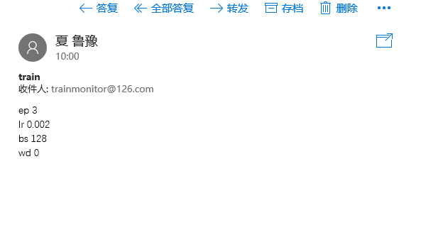
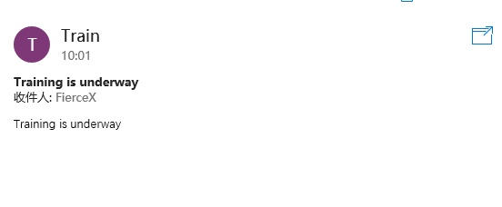
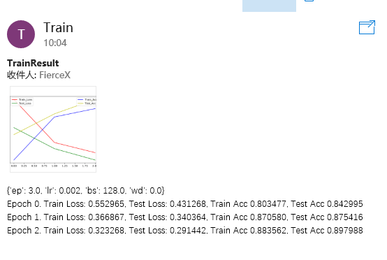
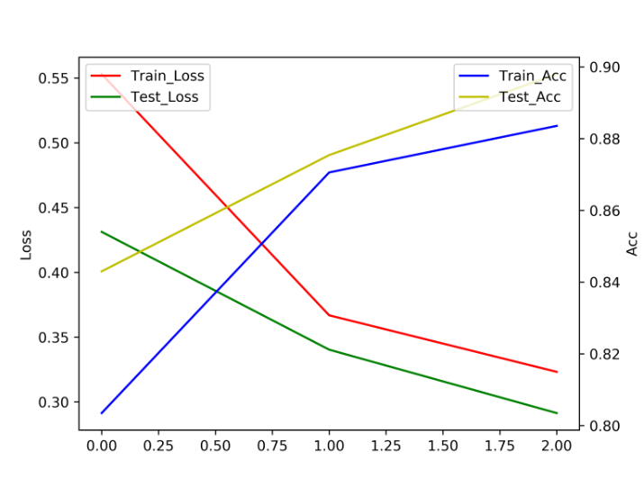

# Email_Monitor_MxnetTrain
## 使用Email监控Mxnet训练
受到小伙伴们的使用微信监控训练的启发，就动手做了个使用邮件监控Mxnet训练的例子  
刚开始使用Pyhton，有些地方可能写的不太好。轻喷  
由于在查多线程的时候，发现Python的多线程受到GIL的影响，多线程会有一些性能局限。所以在这里我另开了一个进程来训练，为了保证训练性能不受影响。  
新加了基于责任链模式的命令解析模块
- EmailNN  
  主要启动代码,包含循环监控邮箱,启动命令解析
- EmailTool  
  自己封装的一些处理邮件的函数
- NN_Train  
  深度学习训练主要代码
- CmdAnalysis
  命令解析模块，包含责任链基类，和责任链前台类以及一些基本的命令解析
- Global
  全局变量模块，用于保存全局变量

## 使用
在Global里配置好自己的邮箱地址,密码和pop,smtp地址  
在NN_Train配置好需要训练的网络和数据等  
在CmdAnalysis里可以修改命令解析，若要新加解析命令，只需要继承`BaseCmd`，并使用`CmdAnaly`类的`Add`方法添加到责任链里即可  
最后启动`EmailNN`即可  
详细解释参见源码和[这里](https://fiercex.github.io/post/email_monitor_mxnettrain/)
 
邮件发送:  
- 训练  
    - 主题为: train  
    - 参数设置  
    各个训练参数和参数值中间空一空格,每个参数和参数值一行
        - ep:  
        epoch
        - lr:  
        learning_rate
        - bs:  
        batch_size
        - wd:  
        weight_decay  
- 设置图片及文件名
  - 主题为: setname
  - 参数设置
  和训练参数设置规则一样
    - dir:
    路径
    - params:
    参数文件名
    - png:
    图片文件名
- 终止监控:
    - 主题为: exit

## 效果

发送的命令

正在训练的时候在发送会提示训练正在进行中

训练结束会发送训练日志和曲线图以及使用的参数

训练曲线图

